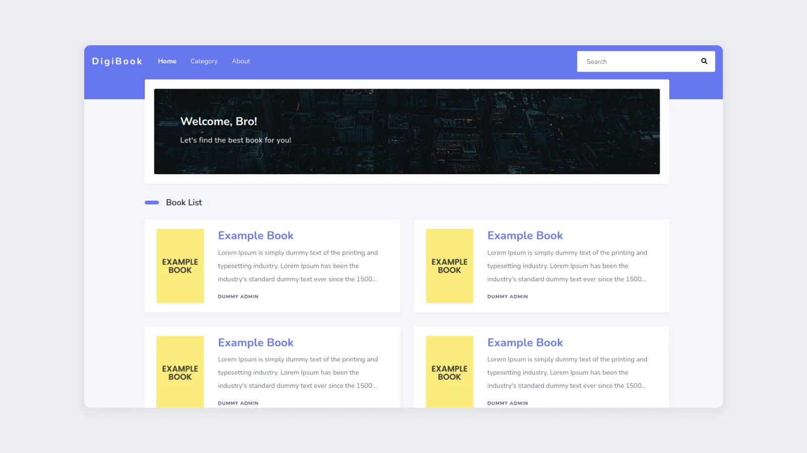

## About Project



Publicly accessible online book website. This website is made as simple as possible, because this project is intended to practice implementing the design of a project.

### Database Structure


### Built With

[](https://laravel.com/)

## Getting Started

### Prerequisites

```sh
```

### Installation
```sh
```


```sh
```

## Usage

### Seed User Admin & Book Category

```sh
php artisan db:seed
```

### Seed Dummy Book

```sh
php artisan db:seed --class=DummyBookSeeder
```

### Run Project

```sh
php artisan serve
```

## License

Distributed under the MIT License. See [LICENSE](LICENSE) for more information.
